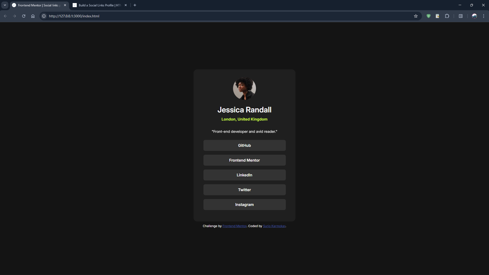

# Frontend Mentor - Social links profile solution

This is a solution to the [Social links profile challenge on Frontend Mentor](https://www.frontendmentor.io/challenges/social-links-profile-UG32l9m6dQ). Frontend Mentor challenges help you improve your coding skills by building realistic projects.

## Table of contents

- [Overview](#overview)
  - [The challenge](#the-challenge)
  - [Screenshot](#screenshot)
  - [Links](#links)
- [My process](#my-process)
  - [Built with](#built-with)
- [Author](#author)

## Overview

### The challenge 🏆

The challenge is to build out this **social links profile** and get it looking as close to the design as possible.

Users should be able to:

- See hover and focus states for all interactive elements on the page

### Screenshots 📸

**Desktop view**

**Mobile view**

### Links 🔗

- Solution URL: [Add solution URL here](https://your-solution-url.com)
- Live Site URL: [Add live site URL here](https://your-live-site-url.com)

## My process ✨

### Built with 🧩

- Semantic HTML5 markup
- CSS custom properties
- Flexbox
- Used CSS clamp() function

## Author 👨‍💻

- Website - [Surjo Karmokar](https://surjo.pages.dev/)
- Frontend Mentor - [@Surjo981](https://www.frontendmentor.io/profile/Surjo981)

## Thank You 🙏✨
